# Santivañez Garcia Harold Eduardo

Se agregaron los géneros para cada película.

### GET http://127.0.0.1:8000/api/genres/

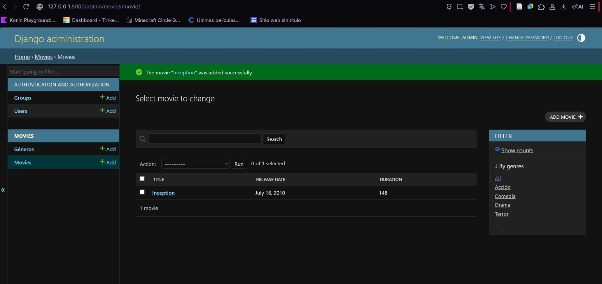

### GET http://127.0.0.1:8000/api/movies/

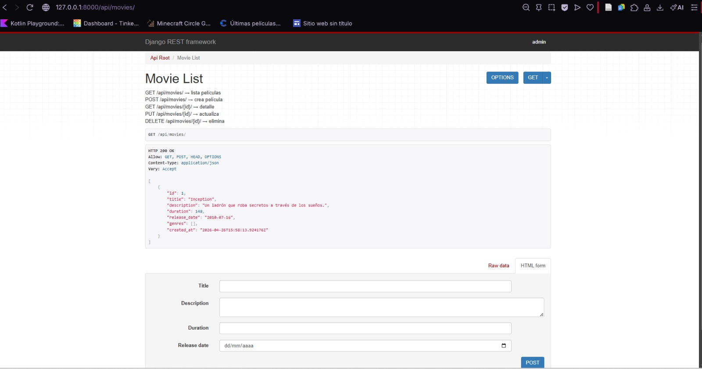
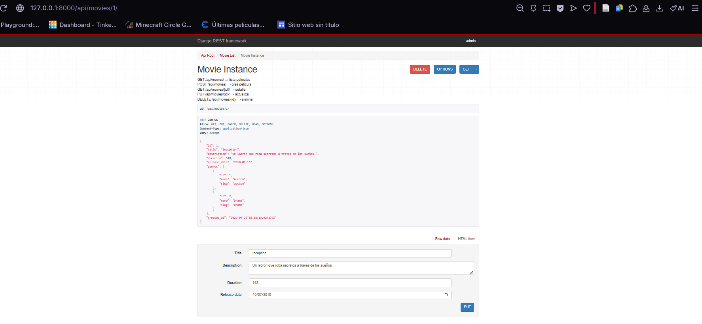

### La parte de http://127.0.0.1:8000/admin/movies/genre/

### Interface http://127.0.0.1:8000/api/movies/

### Interface http://127.0.0.1:8000/api/genres/

 # Salvador Zarate Harold David

### API ROOT

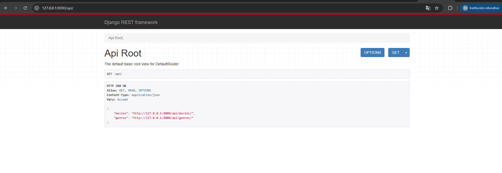

### GET

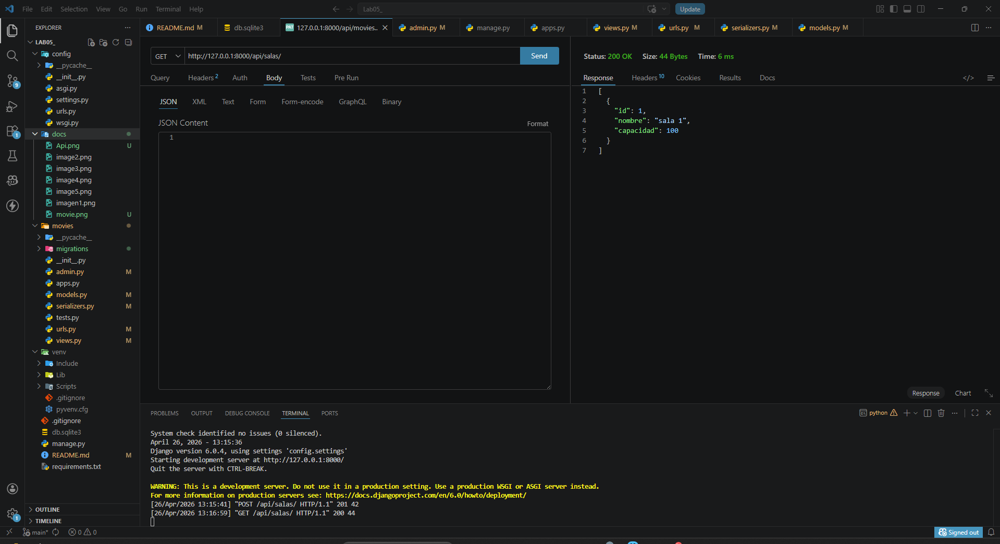
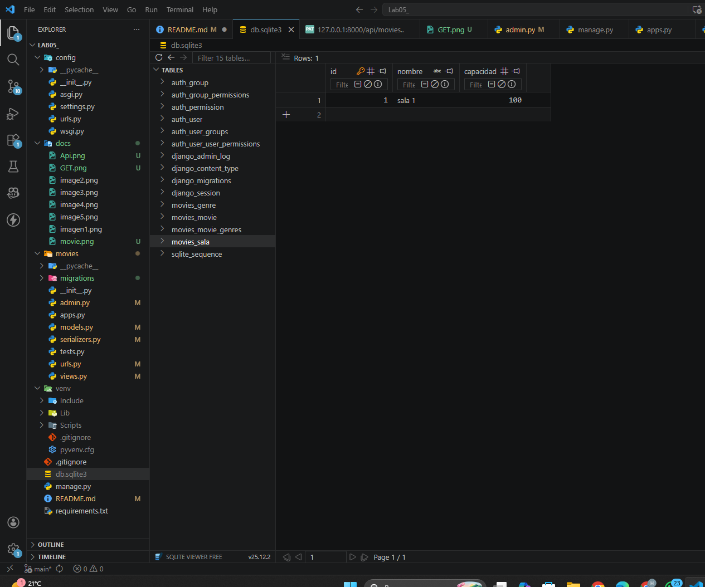

### POST

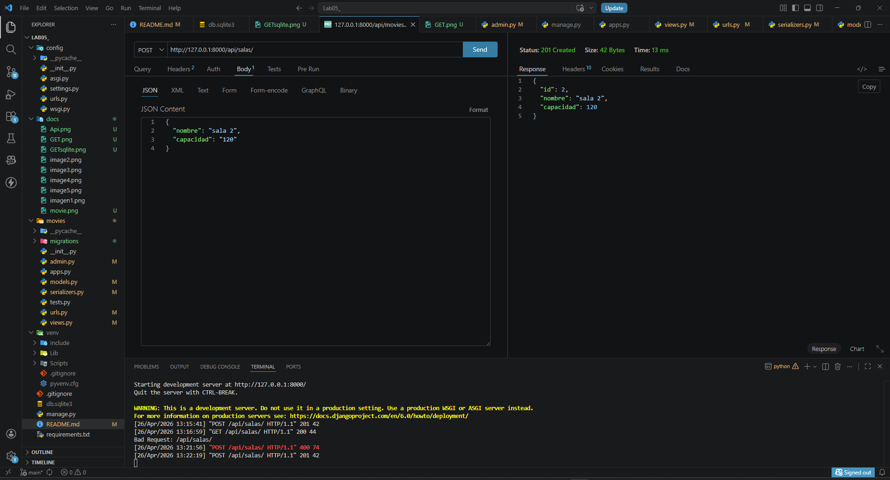
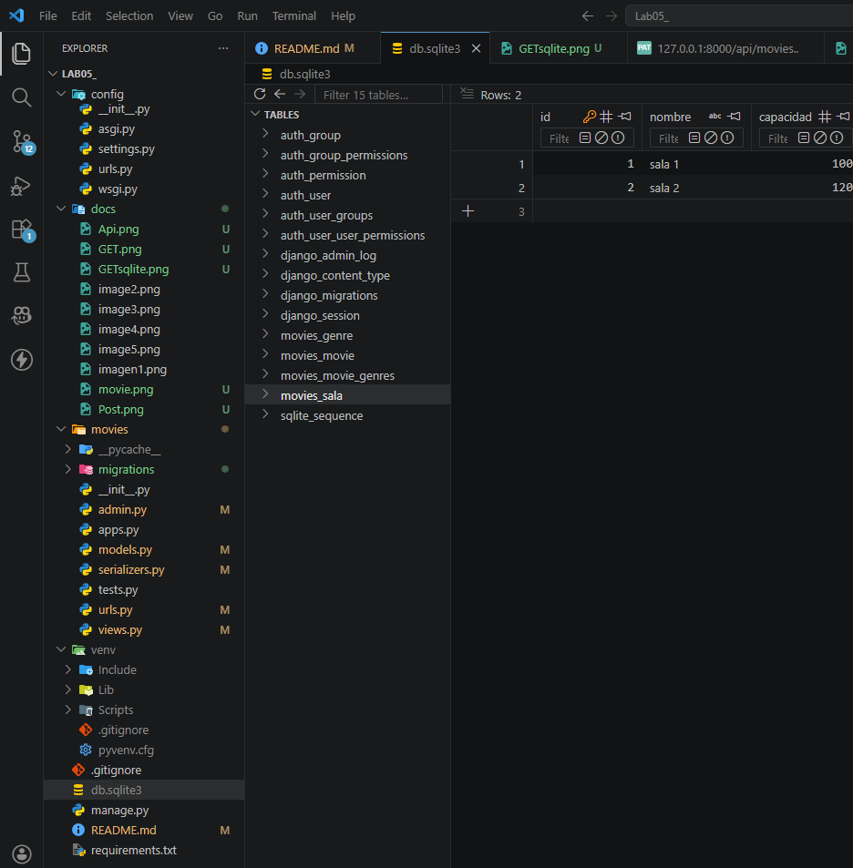

### PUT

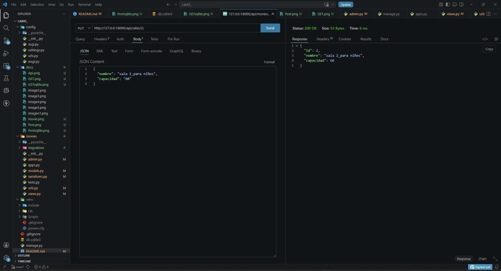
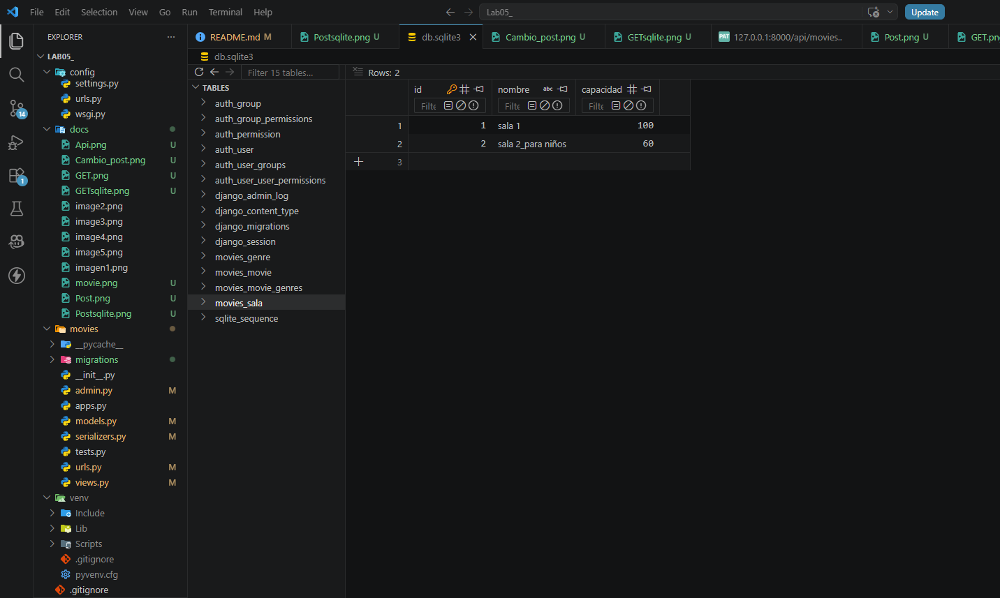

### PATCH

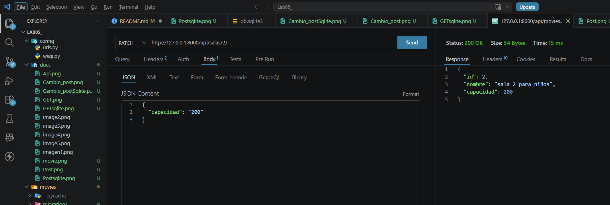
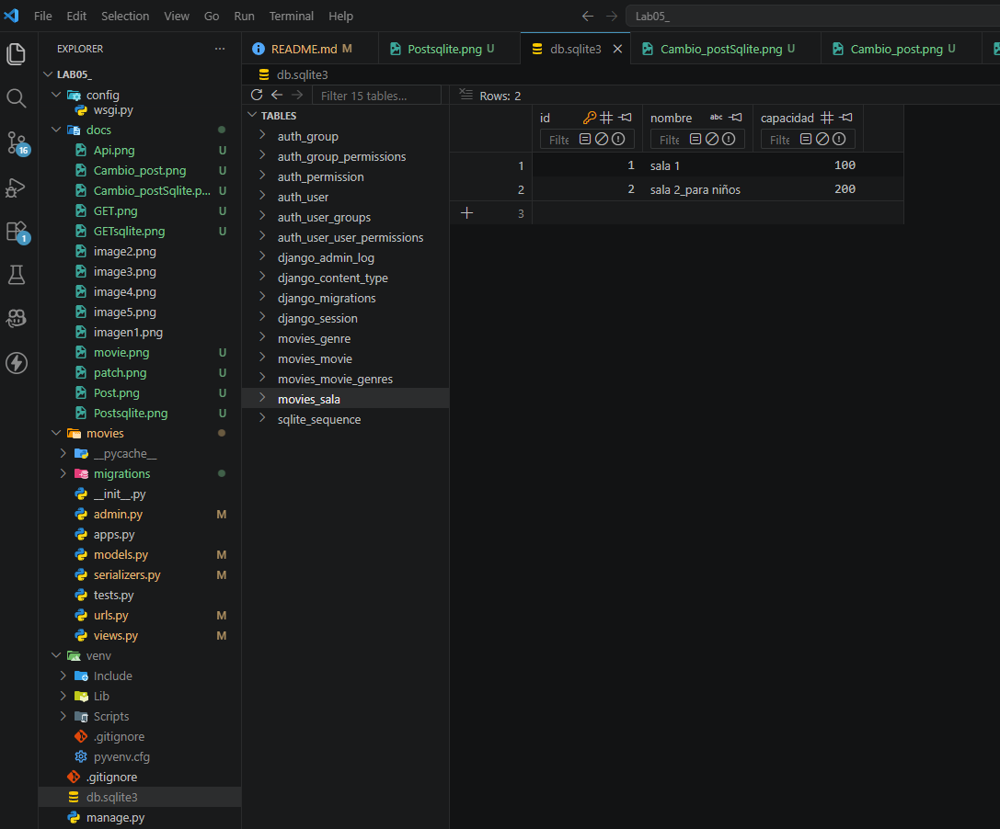

### DELETE

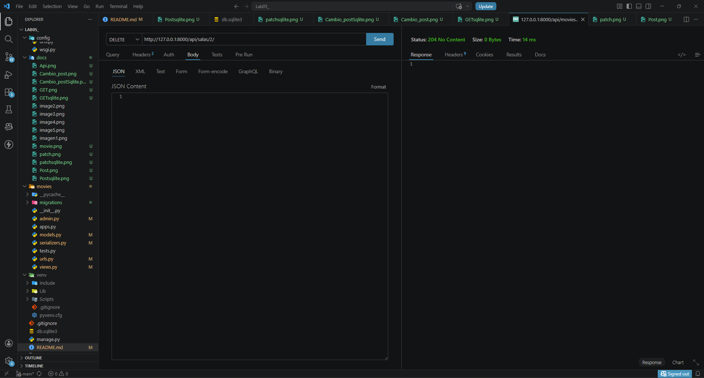
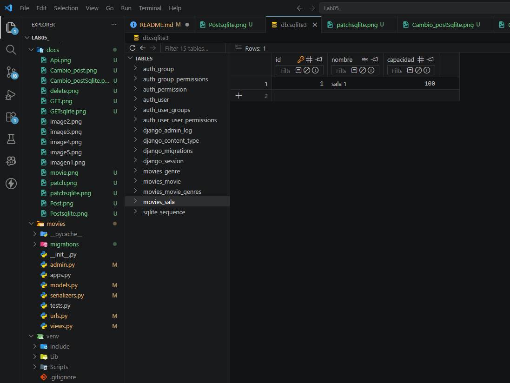